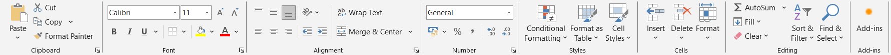
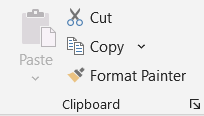
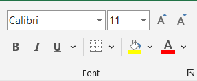
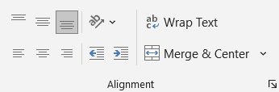
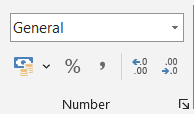
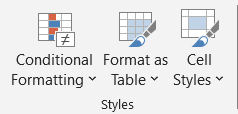
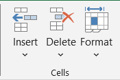
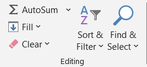

# 
 - - - - - - - - - - Home - - - - - - - - - - 

 
 
 
 

# 1. Clip Board

## Items:

| Items              |   | Description                                                                                                                              |
| ------------------ | - | ---------------------------------------------------------------------------------------------------------------------------------------- |
| **Paste**          | : | Inserts content from the clipboard into the selected cell or range. Includes options like Paste Values, Paste Formatting, and Transpose. |
| **Cut**            | : | Removes the selected content and stores it in the clipboard so it can be pasted elsewhere.                                               |
| **Copy**           | : | Copies the selected content to the clipboard without removing it from the original location.                                             |
| **Format Painter** | : | Copies formatting from one cell or range and applies it to another. Useful for maintaining consistent formatting.                        |

 
 
 
 

# 2. Font

## Items:

| Items          |   | Description                                                                 |
| -------------- | - | --------------------------------------------------------------------------- |
| **Font Type**  | : | Allows you to select a font style (e.g., Arial, Calibri) for text in cells. |
| **Font Size**  | : | Adjusts the size of the text in the selected cells.                         |
| **Bold**       | : | Makes the selected text bold.                                               |
| **Italic**     | : | Italicizes the selected text.                                               |
| **Underline**  | : | Underlines the selected text.                                               |
| **Borders**    | : | Adds or removes borders around selected cells.                              |
| **Fill Color** | : | Fills the background of selected cells with a chosen color.                 |
| **Font Color** | : | Changes the color of the text in the selected cells.                        |

 
 
 
 

# 3. Alignment

## Items:

| Items              |   | Description                                        |
| ------------------ | - | -------------------------------------------------- |
| **Top Align**      | : | Aligns cell content to the top of the cell.        |
| **Middle Align**   | : | Centers the content vertically in the cell.        |
| **Bottom Align**   | : | Aligns cell content to the bottom of the cell.     |
| **Align Left**     | : | Aligns text to the left within the cell.           |
| **Center**         | : | Centers text horizontally in the cell.             |
| **Align Right**    | : | Aligns text to the right within the cell.          |
| **Orientation**    | : | Rotates the text angle (vertical, diagonal, etc.). |
| **Wrap Text**      | : | Wraps text to display all content within the cell. |
| **Merge & Center** | : | Merges selected cells and centers the content.     |

 
 
 
 

# 4. Numbers

## Items:

| Items                 |   | Description                                                                  |
| --------------------- | - | ---------------------------------------------------------------------------- |
| **Number Format**     | : | Applies specific formats like Number, Currency, Date, Time, Percentage, etc. |
| **Increase Decimal**  | : | Adds decimal places to the number.                                           |
| **Decrease Decimal**  | : | Reduces decimal places.                                                      |
| **Comma Style**       | : | Adds commas as thousand separators.                                          |
| **Accounting Format** | : | Aligns currency symbols and decimal points consistently.                     |

 
 
 
 

# 5. Styles

## Items:

| Items                      |   | Description                                                                          |
| -------------------------- | - | ------------------------------------------------------------------------------------ |
| **Conditional Formatting** | : | Highlights cells based on specified rules, such as greater than or duplicate values. |
| **Format as Table**        | : | Converts a cell range into a formatted table with sorting and filtering.             |
| **Cell Styles**            | : | Applies predefined styles for titles, headings, or colored cells.                    |

 
 
 
 

# 6. Cells

## Items:

| Items      |   | Description                                                                     |
| ---------- | - | ------------------------------------------------------------------------------- |
| **Insert** | : | Adds new cells, rows, columns, or worksheets.                                   |
| **Delete** | : | Removes selected cells, rows, columns, or worksheets.                           |
| **Format** | : | Allows you to adjust row height, column width, rename sheets, or protect cells. |

 
 
 
 

# 7. Editing

## Items:

| Items             |   | Description                                                              |
| ----------------- | - | ------------------------------------------------------------------------ |
| **AutoSum**       | : | Quickly adds up numbers in a range using SUM function.                   |
| **Fill**          | : | Fills a series, copies cell content, or uses Flash Fill.                 |
| **Clear**         | : | Removes contents, formats, or comments from selected cells.              |
| **Sort & Filter** | : | Sorts data alphabetically, numerically, or applies filters.              |
| **Find & Select** | : | Searches for data, replaces content, or selects specific types of cells. |
